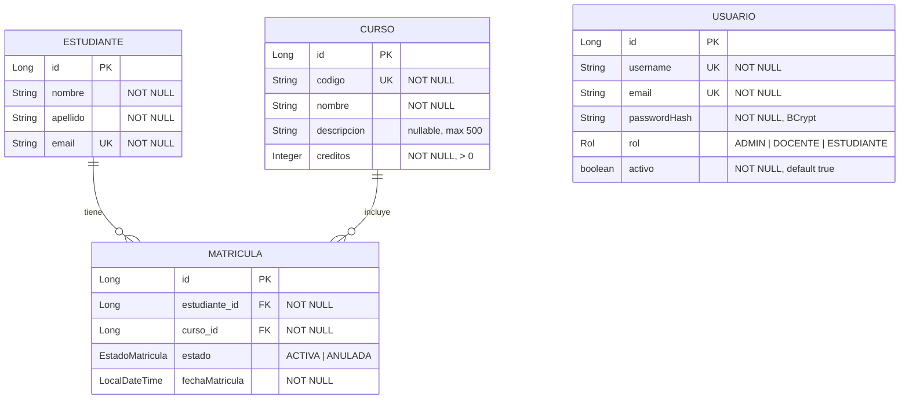
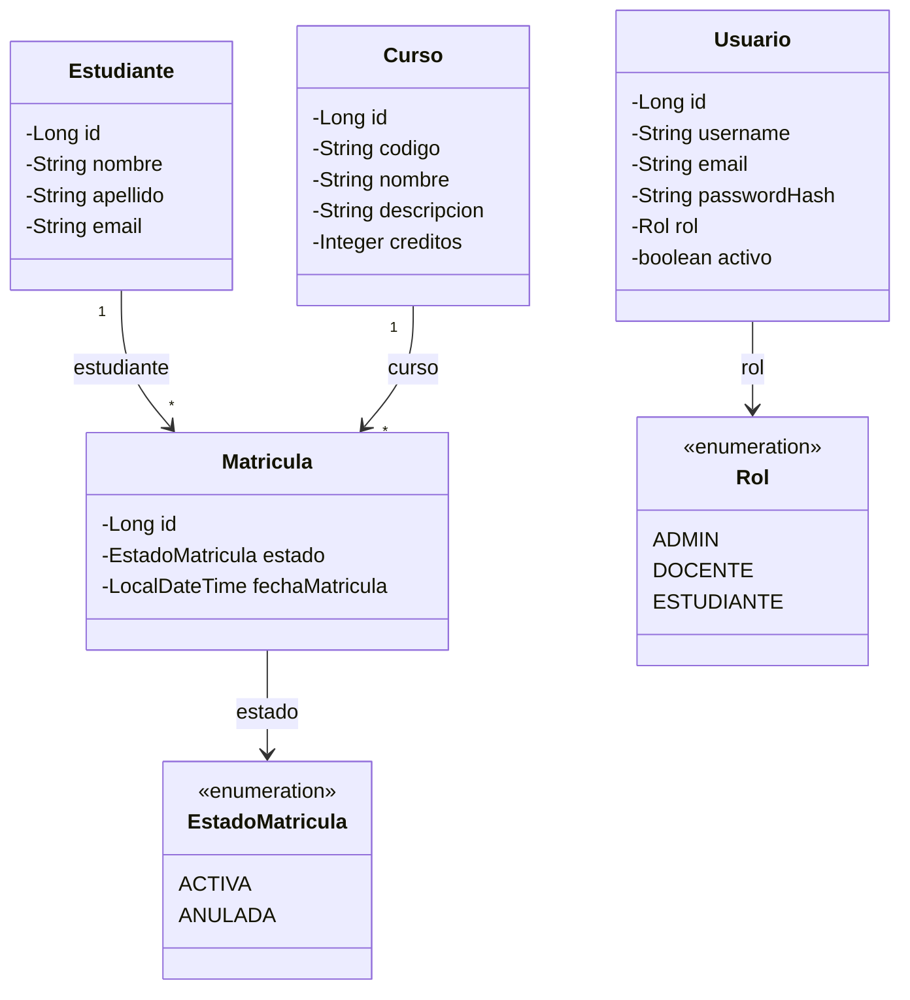

# Demo Académico — Matrículas con JWT

Aplicación monolítica Spring Boot.
Incluye autenticación JWT, cuatro CRUDs (Estudiantes, Cursos, Matrículas, Usuarios) y un frontend HTML/CSS/JS simple.

## Integrantes

* 2190187 — Camilo Andrés Carvajal Castro

## Stack

* Spring Boot 3.x, Spring Security, Spring Data JPA
* MySQL (runtime) / H2 (solo tests)
* JWT (jjwt), BCrypt
* Swagger/OpenAPI (springdoc)
* Frontend estático servido por Spring Boot

## Requisitos

* Java 21+
* Maven Wrapper (`./mvnw`)
* MySQL 8 escuchando en `localhost:3306`

### MySQL con Docker (recomendado)

```bash
docker run --name demo-mysql -e MYSQL_DATABASE=demoacademico \
  -e MYSQL_USER=demo -e MYSQL_PASSWORD=demo \
  -e MYSQL_ROOT_PASSWORD=root \
  -p 3306:3306 -d mysql:8.0
```

## Variables de entorno (opcionales)

| Variable | Default |
|---|---|
| `MYSQL_URL` | `jdbc:mysql://localhost:3306/demoacademico?createDatabaseIfNotExist=true&useSSL=false&allowPublicKeyRetrieval=true&serverTimezone=UTC` |
| `MYSQL_USER` | `demo` |
| `MYSQL_PASSWORD` | `demo` |
| `JWT_SECRET` | clave de desarrollo (mín. 32 caracteres) |


## Ejecutar la aplicación

```bash
cd DemoAcademicoApplication
./mvnw spring-boot:run
```

* Frontend login: http://localhost:8080/
* Panel: http://localhost:8080/app.html
* Swagger: http://localhost:8080/swagger-ui.html

## Credenciales de demostración

| Usuario | Contraseña | Rol |
|---|---|---|
| `admin` | `admin123` | ADMIN |
| `docente` | `docente123` | DOCENTE |
| `estudiante` | `estudiante123` | ESTUDIANTE |

Las contraseñas se almacenan con BCrypt. Son solo de demo académica.

## Autenticación y permisos

* `POST /api/auth/login` — público. Respuesta: `{ token, tipo, rol, expiraEn }` (expiración 24 h).
* Rutas protegidas requieren header `Authorization: Bearer <token>`.
* Lecturas (`GET /api/**`): cualquier usuario autenticado.
* Escrituras (`POST`/`PUT`/`DELETE`): solo `ADMIN`.
* Sin token o token inválido → `401`.
* Rol insuficiente → `403`.

### Token en el frontend

El token se guarda en `sessionStorage` para la demo: se limpia al cerrar la pestaña y reduce la persistencia. No es una afirmación de seguridad absoluta (XSS sigue siendo un riesgo a mitigar con buenas prácticas).

## Modelo de datos (UML)

Diseño actual de la base de datos según las entidades JPA (`estudiante`, `curso`, `matricula`, `usuario`). Los enums se persisten como `STRING`.





Notas:
* `Usuario` es independiente de `Estudiante` (no hay FK entre ellos).
* La baja de una matrícula es lógica: `estado = ANULADA`.
* Unicidades: `estudiante.email`, `curso.codigo`, `usuario.username`, `usuario.email`.

## Endpoints principales

### Estudiantes — `/api/estudiantes`
`GET`, `GET /{id}`, `GET /buscar?email=`, `GET /pagina`, `POST`, `PUT /{id}`, `DELETE /{id}`

### Cursos — `/api/cursos`
`GET`, `GET /{id}`, `POST`, `PUT /{id}`, `DELETE /{id}`

### Matrículas — `/api/matriculas`
`GET`, `GET /{id}`, `POST` (body: `{ estudianteId, cursoId }`), `PUT /{id}/anular`  
La baja es **anulación lógica** (`estado = ANULADA`), no borrado físico.

### Usuarios — `/api/usuarios`
`GET`, `GET /{id}`, `POST`, `PUT /{id}`, `DELETE /{id}`  
Las respuestas **nunca** incluyen el hash de contraseña.
  

## Pruebas

```bash
cd DemoAcademicoApplication
./mvnw test
```

Los tests usan el perfil `test` con H2 en memoria (no requieren MySQL). Cubren login, 401/403, email duplicado, créditos inválidos, matrícula duplicada activa y anulación.

## Notas de alcance

* Arquitectura actual: **monolito** en capas (controller → service → repository). Microservicios quedan para una iteración futura.
* Persistencia de demo/runtime: **MySQL**.
